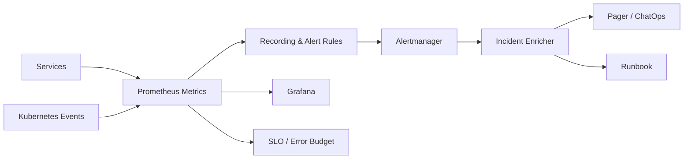

# Reliability Architecture

The design separates signal collection, alert evaluation, enrichment, and human response. Automated remediation is intentionally bounded so incidents remain auditable and reversible.
